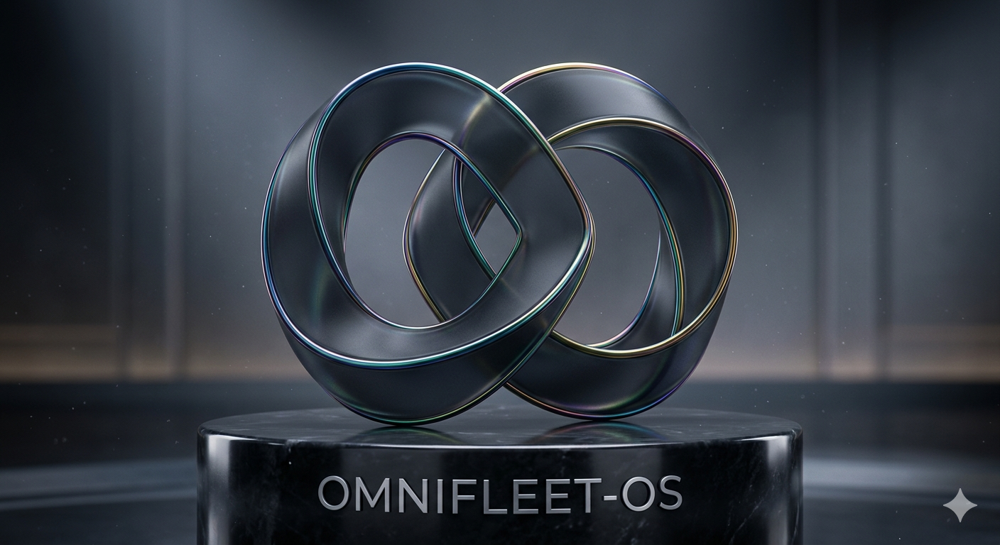

# OmniFleet-OS
<p align="center">
  
</p>

   

### Tech Stack & Architecture

**Core Languages**
   

**Cloud & Storage**
   

**AI & Generative R&D**
 

**Hardware Compute Clusters**
  

**Cybersecurity & Red Teaming**
 

---

## What is this?
OmniFleet-OS is a hardware-agnostic, polyglot operating system engineered for enterprise-scale autonomous EV fleets. Built on a modular microservice framework, it bridges the gap between decentralized yield optimization, localized peer-to-peer vehicle networking, and automated physical asset management.

## What this does?
* **Automated Yield Optimization:** The system continuously monitors external APIs to route idle vehicles toward peak Uber/Lyft surge zones or seamlessly orchestrates remote Turo leasing handoffs without human intervention.
* **Energy Arbitrage (V2G):** Synthesizes kinetic regeneration and solar roof yields, dynamically discharging stored battery power back to the municipal grid when spot prices peak.
* **Biometric Fail-Secure Infrastructure:** Leverages edge-AI face authentication to verify renters, combined with an internal fail-secure mechanism that immobilizes the drivetrain if biometric constraints or security network tripwires are breached.
* **Decentralized Settlement:** Operates an internal mesh wallet node that automatically sweeps operational fiat into Web3 cryptographic tokens (e.g., BULLISH) to decentralize infrastructure yields.
* **Red-Team Environment:** Runs an active Aegis internal auditing daemon that continuously fuzzes internal routing endpoints to guarantee zero-day resilience.

## How to install this?

**Prerequisites:** You will need Docker, Python 3.11+, Rust (stable), and Go 1.21+ installed on your host cluster.

**1. Clone the Repository**
```bash
git clone [https://github.com/credkellar-boop/OmniFleet-OS.git](https://github.com/credkellar-boop/OmniFleet-OS.git)
cd OmniFleet-OS
